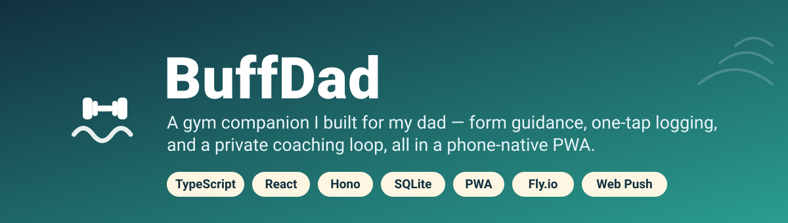
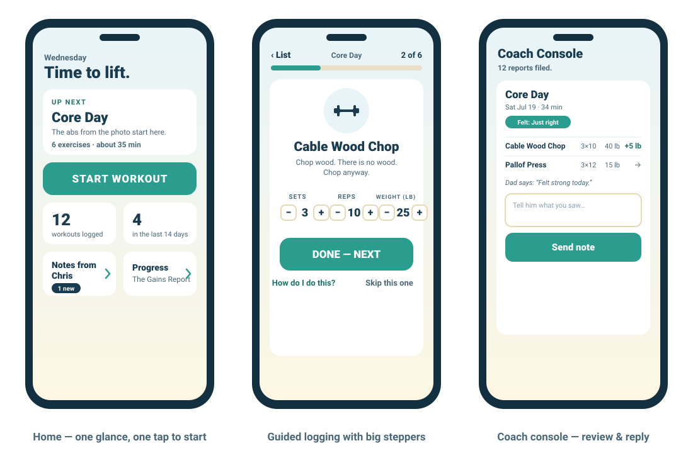
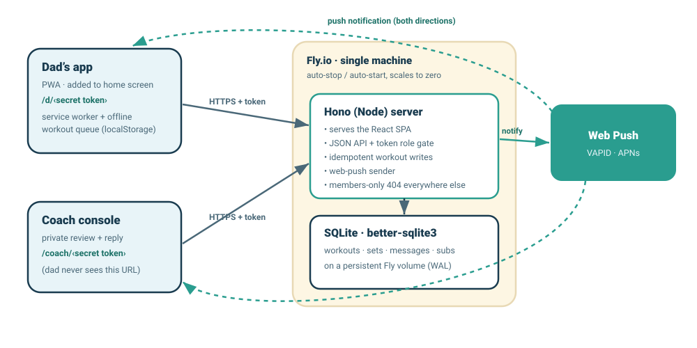

<p align="center">
  
</p>

<p align="center">
  
  
  
  
  
</p>

## The story

My dad is in his late 70s, swims almost every day, and is forever texting me for workout ideas — *"what should I do for my core?"* So instead of texting back another list, I built him an app.

**BuffDad** is a mobile-first PWA he installs to his iPhone home screen and opens like any native app. No login (he'd never remember a password), huge type, and everything is one big tap. It suggests a workout, walks him through it with proper form, and logs what he did with almost no typing.

The twist: when he taps **finish**, his workout lands on a private **coach console** that only I can see. I review what he did, send a note, and it pops up in his app — with a push notification both ways. Two people, one little feedback loop.

<p align="center">
  
</p>

## What it does

**For Dad**
- 🏋️ **Rotating workouts** — four templates (Core Day, Full Body A/B, Cable & Carry) that cycle automatically. No calendar, no schedule pressure; he trains as often or as rarely as he likes.
- ✅ **Near-zero-typing logging** — a scrollable checklist, then a full-screen card per exercise with giant +/− steppers pre-filled from last time. Usually it's one big **DONE** tap.
- 📖 **Form help on every exercise** — plain-language cues, common mistakes, senior-safe variants, and a hand-verified demo video, for all 44 exercises.
- 📈 **Progress** — an 8-week dot calendar, per-exercise weight trends, and a fun monthly total (*"you've lifted a walrus this month"*).
- 💬 **Encouraging, humor-first, zero-guilt** — no streak-shaming, no emojis in the UI, huge fonts and 56px+ tap targets designed for a 78-year-old.

**For the coach (me)**
- 🔒 A private console at a secret URL Dad never sees.
- 📊 Per-exercise deltas (`+5 lb`), feel ratings, and Dad's own notes.
- ↩️ Reply to any workout → it appears in his app, with a push notification.

**Under the hood**
- 📶 **Offline-safe** — gym Wi-Fi is flaky, so logging is optimistic and queued in `localStorage`, then synced with idempotent, single-flight retries (no lost or duplicated workouts).
- 📱 **Feels native** — installable PWA, custom icon + splash, and the document scroll is locked so there's no browser-style rubber-band bounce.

## How it works

<p align="center">
  
</p>

- **No accounts.** Access is two unguessable secret URLs — `/d/<token>` for Dad, `/coach/<token>` for the coach. The server derives the role from whichever token matches; every other path returns a "members only" 404. In production the server refuses to boot if the tokens are missing or left as the dev defaults.
- **One small Fly.io machine** with auto-stop/auto-start, so it scales to zero when idle and costs almost nothing.
- **Self-contained** — one Node container serves the SPA, the JSON API, and web-push; SQLite lives on a persistent Fly volume. No external database, no third-party auth.

## Tech stack

| Layer | Choice |
| --- | --- |
| Frontend | React 19 + Vite, Tailwind CSS v4, hand-drawn inline-SVG illustrations |
| Backend | Hono (Node), one process for SPA + API + static + push |
| Data | SQLite via `better-sqlite3` (WAL) on a Fly volume |
| Notifications | Web Push (VAPID), service worker |
| Language | TypeScript, `strict` |
| Tests | `node --test` |
| Hosting | Fly.io — single machine, auto-stop, scale-to-zero |

## Getting started (local)

Requires **Node 22+**.

```bash
git clone https://github.com/chrisconnelly3/buffdad.git
cd buffdad
npm install
npm run dev
```

Then open:

- **Dad's app** → http://localhost:5173/d/dev-dad
- **Coach console** → http://localhost:5173/coach/dev-coach

Local dev uses throwaway `dev-dad` / `dev-coach` tokens and needs no configuration. Push notifications are simply disabled until you add VAPID keys (see [`.env.example`](.env.example)).

Other scripts:

```bash
npm test                 # run the test suite (node --test)
npm run build            # build the SPA + bundle the server
npm start                # serve the production build
```

## Deploy

The whole thing runs on a single Fly.io machine with SQLite on a volume. Step-by-step commands (PowerShell and bash) are in **[docs/DEPLOY.md](docs/DEPLOY.md)**, and there's a plain-English iPhone install walkthrough in **[docs/INSTALL-DAD.md](docs/INSTALL-DAD.md)**.

## Project structure

```
buffdad/
├─ server/            # Hono API + static serving + web-push
│  ├─ app.ts          #   routes, token role-gate, manifests, members-only page
│  ├─ db.ts           #   SQLite schema
│  ├─ push.ts         #   web-push sender + dead-subscription cleanup
│  └─ index.ts        #   entry: production boot guards + push wiring
├─ shared/            # types + content shared by client and server
│  ├─ exercises.ts    #   44-exercise library (cues, mistakes, safety, videos)
│  └─ templates.ts    #   rotating workout templates
├─ src/               # React single-page app
│  ├─ screens/        #   Splash, Home, Workout, ExerciseCard, Help, Finish, Progress, CoachNotes, Coach
│  ├─ illustrations.tsx  # inline-SVG exercise figures
│  ├─ session.ts      #   smart-default logging session model
│  └─ api.ts          #   fetch client + offline queue
├─ public/            # service worker, icons, splash image
├─ tests/             # node --test suites
├─ docs/              # deploy guide, install guide, design spec & plan
├─ Dockerfile
└─ fly.toml
```

## How it was built

BuffDad was vibecoded end-to-end with [Claude Code](https://claude.com/claude-code): brainstorm → written spec → a task-by-task implementation plan → a subagent-driven build with per-task spec + code review → a functional review pass (auth, offline queue, data integrity) → deploy. If you're curious about the process, the original **[design spec](docs/superpowers/specs/)** and **[implementation plan](docs/superpowers/plans/)** are in the repo.

## Notes

- The buff beach photo on the splash screen is an **AI-generated joke** — my dad does not (yet) look like that. It's aspirational.
- No personal data or secrets ship in this repo; deploy-time tokens and VAPID keys live in Fly secrets, never in git.

## License

MIT — see [LICENSE](LICENSE).
